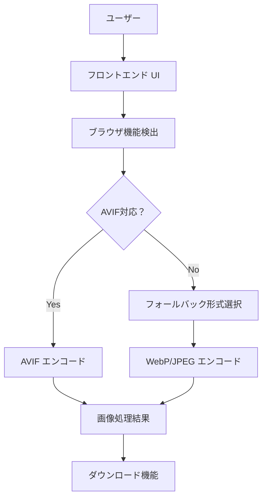
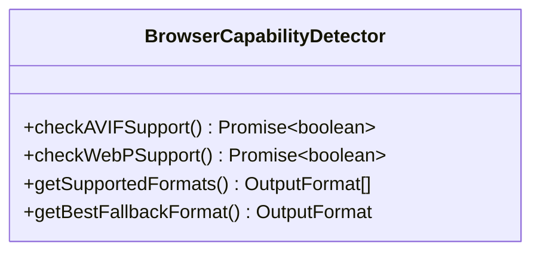
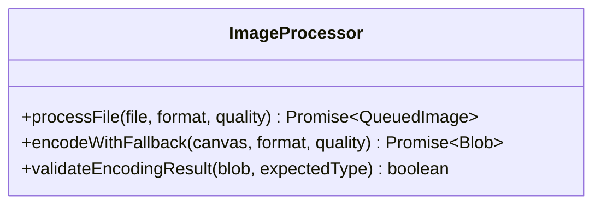
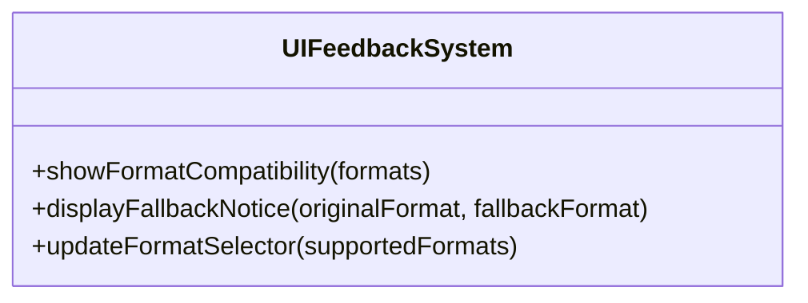
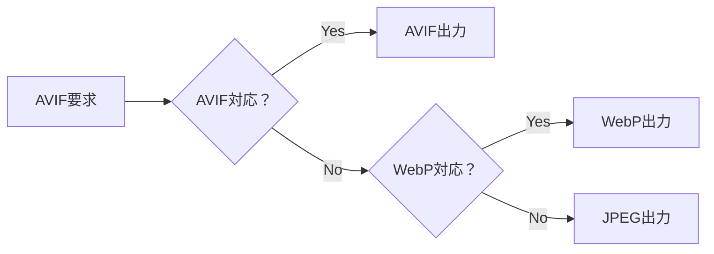
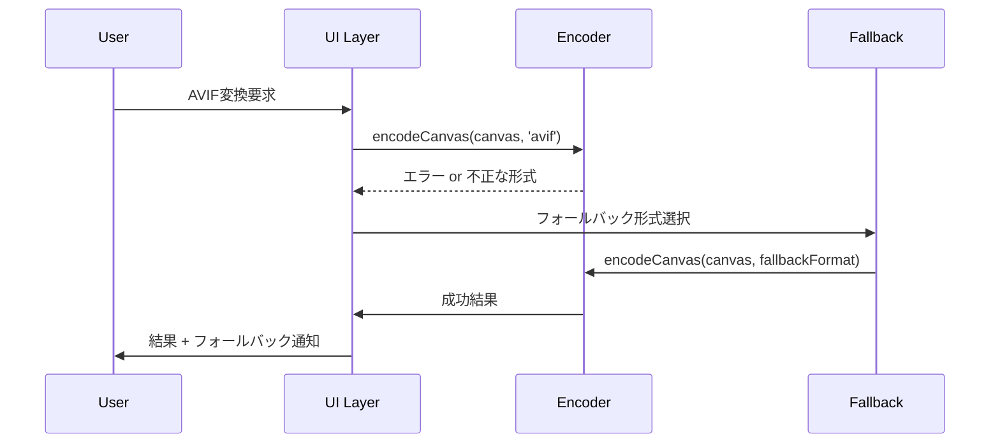
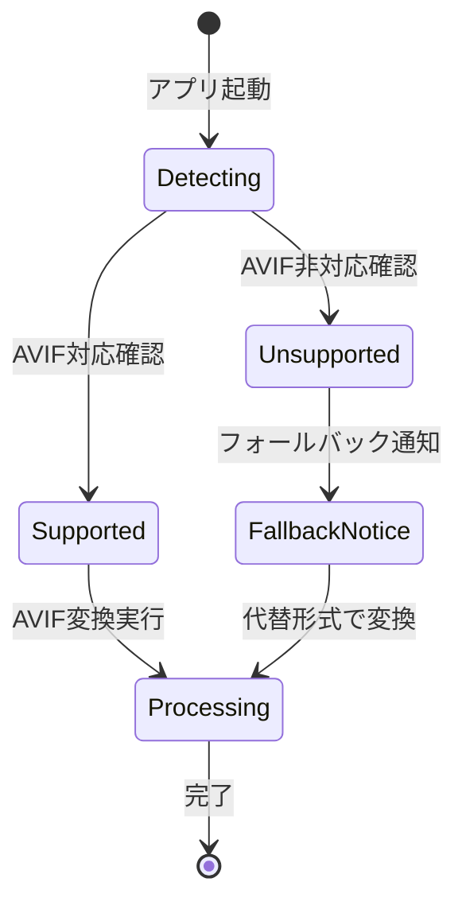
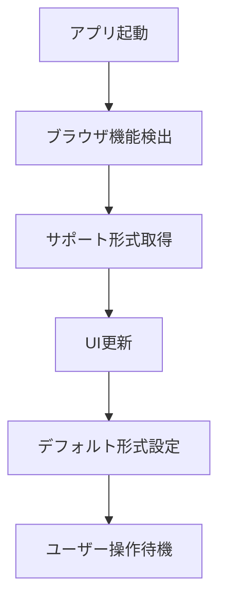
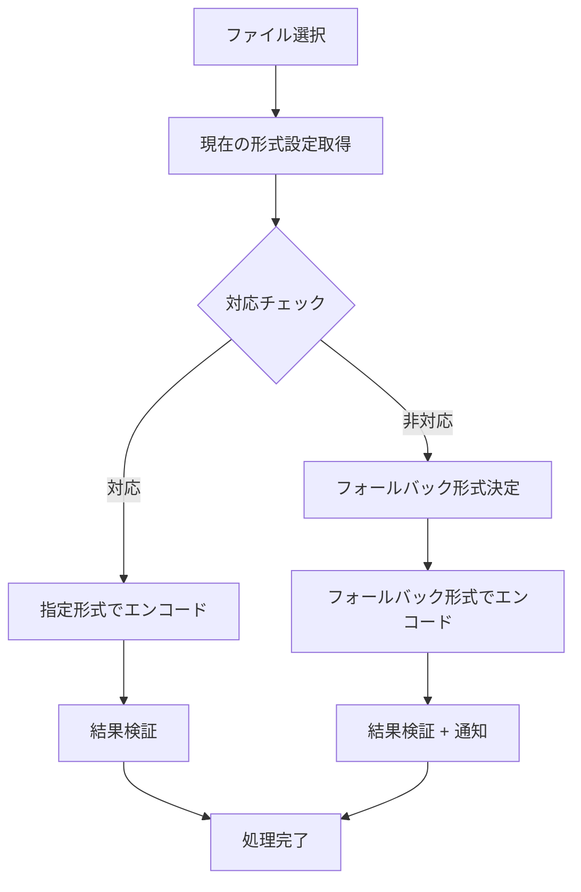
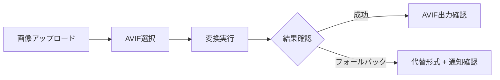

# AVIF ブラウザ互換性対応改修設計

## 概要

Image Sharpener プロジェクトにおいて、AVIF 形式の出力が古いブラウザや一部のブラウザで未対応の問題を解決するため、フォールバック機能付きの AVIF 対応システムを実装する。

### 現状の課題

- `canvas.toBlob()` で AVIF 形式を指定してもブラウザが未対応の場合、異なる形式で出力される
- エラーハンドリングが不十分で、ユーザーが AVIF 非対応ブラウザでエラーを体験する
- AVIF 対応状況の事前チェック機能がない

### 改修目標

- すべてのブラウザで安定した動作を実現
- AVIF 非対応ブラウザでは自動的にフォールバック形式を提供
- ユーザーに対する明確な対応状況表示

## アーキテクチャ

### システム構成



### コンポーネント設計

#### 1. ブラウザ機能検出モジュール



#### 2. 画像処理エンジン



#### 3. UI フィードバック システム



## 技術仕様

### ブラウザ機能検出

#### AVIF サポート検出メソッド

```typescript
async function checkAVIFSupport(): Promise<boolean> {
  // テスト画像を作成してAVIF対応をチェック
  const canvas = document.createElement('canvas');
  canvas.width = 1;
  canvas.height = 1;
  
  try {
    const blob = await new Promise<Blob | null>((resolve) =>
      canvas.toBlob(resolve, 'image/avif', 0.8)
    );
    
    return blob !== null && blob.type === 'image/avif';
  } catch {
    return false;
  }
}
```

#### サポート形式マトリックス

| ブラウザ | AVIF | WebP | JPEG | PNG |
|----------|------|------|------|-----|
| Chrome 85+ | ✓ | ✓ | ✓ | ✓ |
| Firefox 93+ | ✓ | ✓ | ✓ | ✓ |
| Safari 16.4+ | ✓ | ✓ | ✓ | ✓ |
| Edge 90+ | ✓ | ✓ | ✓ | ✓ |
| 古いブラウザ | ✗ | ✓/✗ | ✓ | ✓ |

### フォールバック戦略

#### 優先順位ベースのフォールバック



#### 品質設定の調整

| 元形式 | フォールバック形式 | 品質調整 |
|--------|-------------------|----------|
| AVIF | WebP | 同じ品質値 |
| AVIF | JPEG | +0.1 (圧縮効率差の補正) |

### エラーハンドリング

#### エンコード失敗時の処理フロー



### UI/UX 改善

#### フォーマット選択の改善

```typescript
interface FormatOption {
  value: OutputFormat;
  label: string;
  supported: boolean;
  fallbackInfo?: {
    format: OutputFormat;
    reason: string;
  };
}
```

#### ユーザー通知システム



## 実装詳細

### フロントエンド改修項目

#### 1. 機能検出モジュールの追加

**新規ファイル**: `src/browserCapabilities.ts`

- AVIF サポート検出
- WebP サポート検出
- サポート形式の一覧取得
- 最適なフォールバック形式の決定

#### 2. 画像処理ロジックの強化

**修正ファイル**: `src/main.ts`

- `encodeCanvas` 関数の改良
- フォールバック機能の実装
- エンコード結果の検証強化
- エラーメッセージの改善

#### 3. UI フィードバックの実装

**修正ファイル**: `src/main.ts`

- フォーマット選択肢の動的更新
- フォールバック通知の表示
- ブラウザ対応状況の表示

#### 4. ユーザー体験の向上

**修正ファイル**: `index.html`, `style.css`

- フォーマット対応状況の視覚的表示
- フォールバック時の通知バナー
- ヘルプメッセージの改善

### データフロー

#### 初期化フロー



#### 画像処理フロー



## テスト戦略

### 単体テスト

#### ブラウザ機能検出テスト

```typescript
describe('BrowserCapabilityDetector', () => {
  test('AVIF対応ブラウザで true を返す', async () => {
    // モックCanvas APIでAVIF対応をシミュレート
  });
  
  test('AVIF非対応ブラウザで false を返す', async () => {
    // モックCanvas APIでAVIF非対応をシミュレート
  });
});
```

#### フォールバック機能テスト

```typescript
describe('ImageProcessor', () => {
  test('AVIF非対応時にWebPにフォールバック', async () => {
    // フォールバック処理の動作確認
  });
  
  test('WebPも非対応時にJPEGにフォールバック', async () => {
    // 二段階フォールバックの確認
  });
});
```

### 統合テスト

#### ブラウザ互換性テスト

| テストケース | Chrome | Firefox | Safari | Edge | 古いブラウザ |
|-------------|--------|---------|--------|------|-------------|
| AVIF選択時の動作 | AVIF出力 | AVIF出力 | AVIF出力 | AVIF出力 | WebP/JPEG |
| エラー表示 | なし | なし | なし | なし | フォールバック通知 |
| UI状態 | 正常 | 正常 | 正常 | 正常 | 代替表示 |

### E2E テスト

#### ユーザーシナリオテスト



## パフォーマンス考慮事項

### 機能検出の最適化

- 起動時に一度だけ実行
- 結果をメモリにキャッシュ
- 非同期処理で UI ブロックを回避

### フォールバック処理の効率化

- 対応形式の事前判定でムダな処理を回避
- エンコード失敗時の早期リターン
- メモリリークの防止（URL オブジェクトの適切な解放）

## セキュリティ考慮事項

### 画像処理セキュリティ

- Canvas API の安全な使用
- ファイル形式の検証強化
- XSS 攻撃への対策（blob URL の適切な管理）

### コンテンツセキュリティ

**修正ファイル**: `worker/src/index.ts`

```typescript
// CSP ヘッダーの更新（必要に応じて）
"img-src 'self' blob: data:"  // blob URL 使用のため維持
```

## 展開計画

### フェーズ 1: 機能検出実装

1. ブラウザ機能検出モジュールの作成
2. 基本的なフォールバック機能の実装
3. 単体テストの作成

### フェーズ 2: UI/UX 改善

1. フォーマット選択の改善
2. ユーザー通知システムの実装
3. スタイルの調整

### フェーズ 3: テスト・検証

1. 各種ブラウザでの動作確認
2. エラーケースのテスト
3. パフォーマンス測定

### フェーズ 4: 最適化・改善

1. 機能検出の最適化
2. エラーメッセージの改善
3. ドキュメントの更新

## 成功指標

### 技術指標

- AVIF 非対応ブラウザでのエラー発生率: 0%
- フォールバック成功率: 100%
- 機能検出の実行時間: < 100ms

### ユーザー体験指標

- ユーザーの混乱を示すエラー報告: 大幅減少
- フォーマット選択時の分かりやすさ: 向上
- 全体的な変換成功率: 向上